# Cetus AMM 对象所有权架构文档

## 概述

本文档详细说明了 Cetus AMM 合约中的对象所有权设计，包括共享对象、拥有对象和不可变对象的架构模式。

## 核心对象类型架构

### 对象所有权层次结构

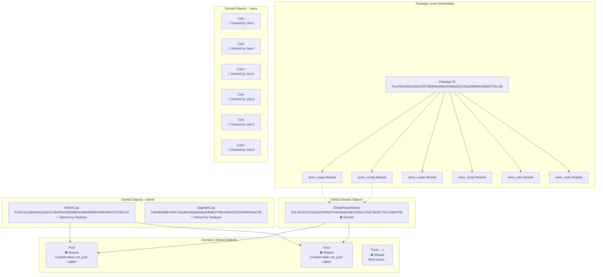

## 对象详细分析

### 1. 不可变对象 (Immutable Objects)

#### Package 对象
```rust
// 部署时创建，永不可变
Package ID: 0xe2f4a0385a2b5e31f67095fb4ba99e3048eb05012ba3698ef6c80fbb675fe138
```

**特征**：
- ✅ 任何人都可以调用其中的公开函数
- ❌ 部署后无法修改代码（除非升级）
- 🔄 所有函数调用都引用这个 Package ID

### 2. 共享对象 (Shared Objects)

#### GlobalPauseStatus - 全局控制中心

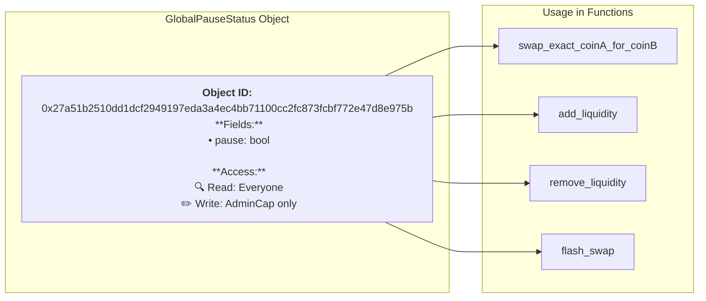

**代码实现**：
```rust
// amm_config.move:14-17
struct GlobalPauseStatus has key {
    id: UID,
    pause: bool,
}

// 创建时立即共享
fun init(ctx: &mut TxContext) {
    let global_pause_status = GlobalPauseStatus {
        id: object::new(ctx),
        pause: false
    };
    transfer::share_object(global_pause_status);  // 🌐 设为共享
}
```

#### Pool 对象 - 流动性池

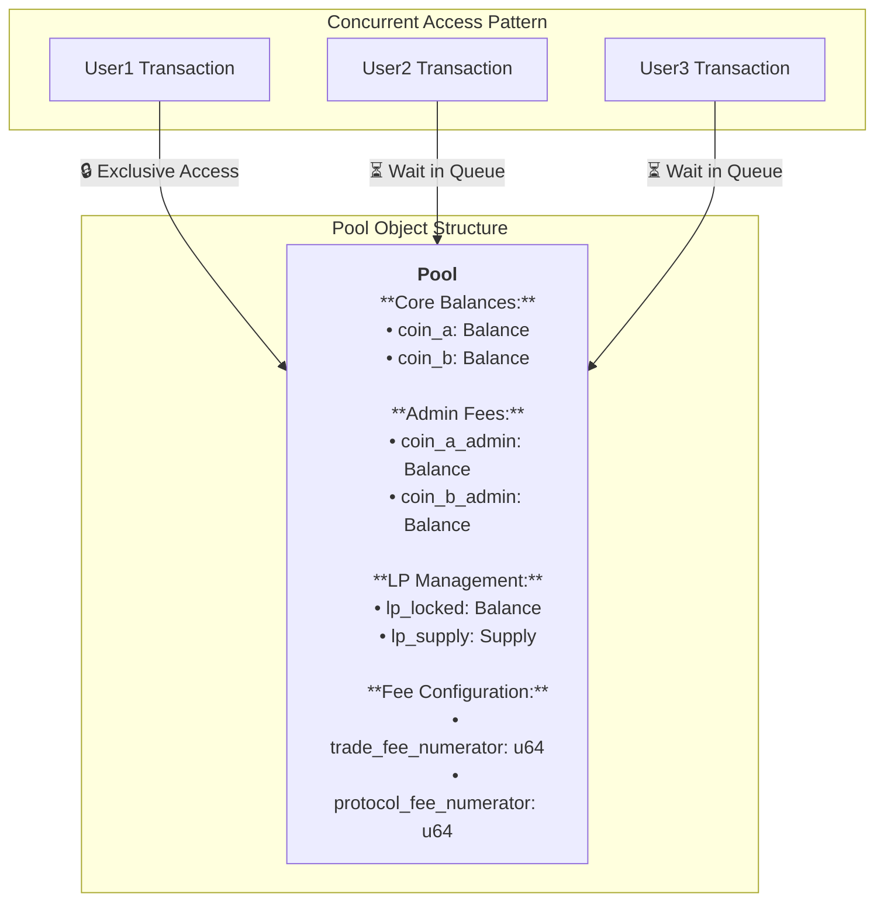

**并发访问规则**：
```rust
// 所有修改 Pool 的操作都需要 &mut Pool 引用
public fun swap(
    pool: &mut Pool<CoinA, CoinB>,  // 🔒 独占访问
    // ...
) {
    // 修改池子状态
    // 同时只能有一个交易执行
}
```

### 3. 拥有对象 (Owned Objects)

#### AdminCap - 管理员权限令牌

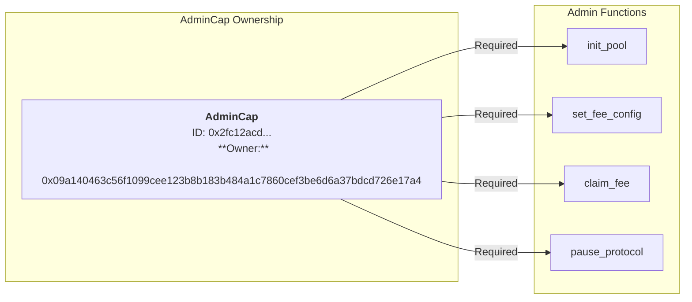

**权限验证机制**：
```rust
// 无需地址检查，所有权即权限
public fun init_pool<CoinA, CoinB>(
    _admin_cap: &AdminCap,  // 👤 必须拥有才能传入
    // ...
) {
    // 如果能调用到这里，就证明调用者拥有 AdminCap
    // Sui 系统保证了这一点
}
```

#### 用户代币对象

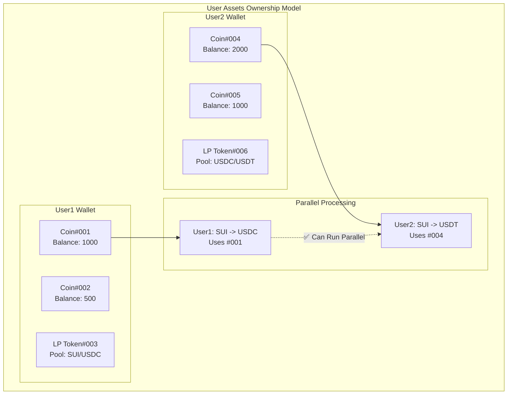

## 交易流程中的所有权变化

### 代币交换流程

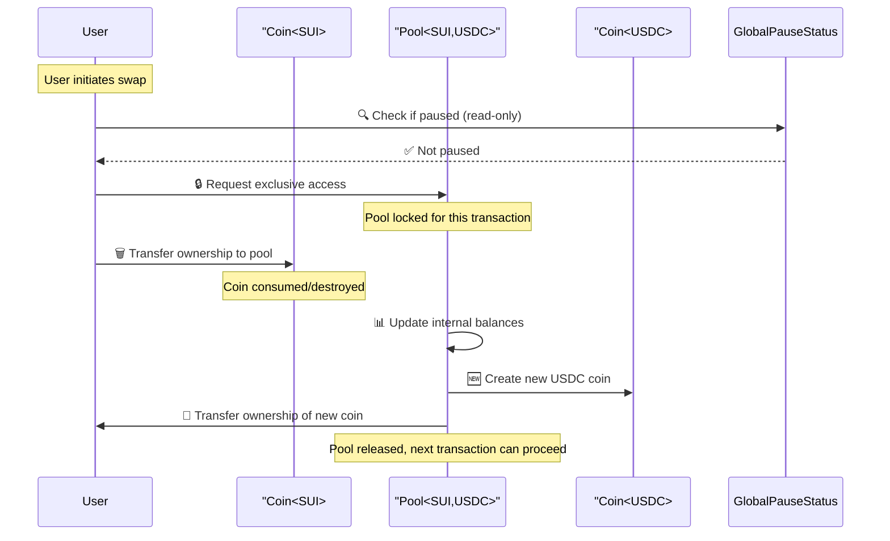

### 添加流动性流程

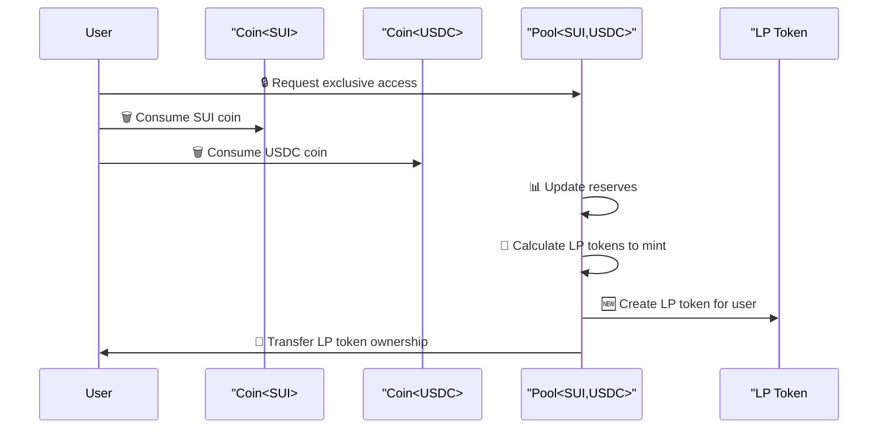

### 管理员操作流程

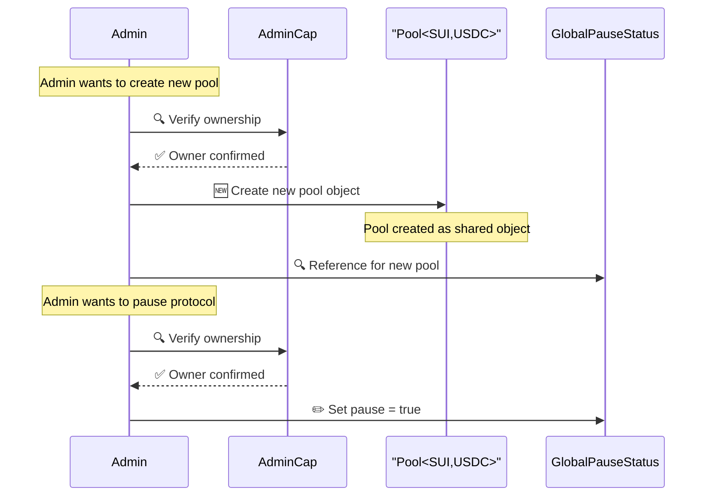

## 并发性能分析

### 并发能力矩阵

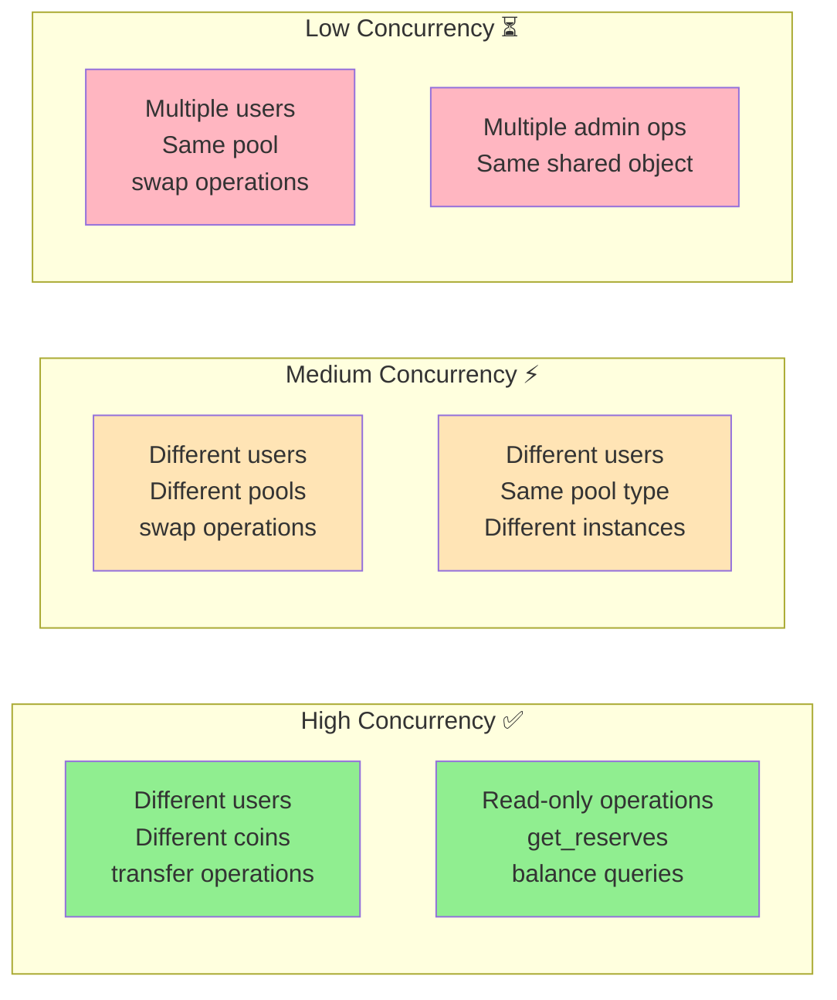

### 性能瓶颈识别

**共享对象热点**：
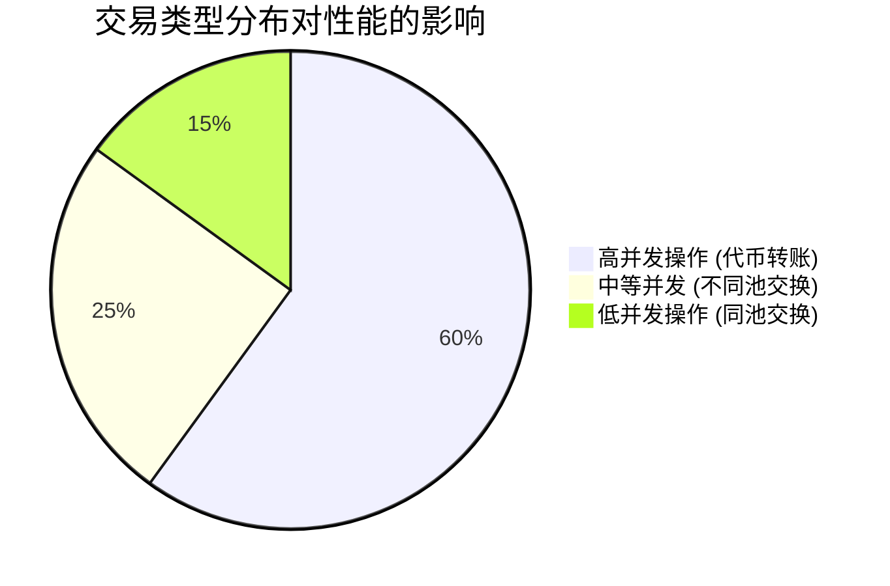

## 设计模式和最佳实践

### 1. 最小化共享状态

```rust
// ✅ 好的设计 - 用户状态独立
struct UserPosition has key, store {
    id: UID,
    liquidity: u64,
    // 每个用户独立的对象
}

// ❌ 避免的设计 - 全局用户映射
struct GlobalUserData has key {
    user_positions: Table<address, UserPosition>, // 共享瓶颈
}
```

### 2. 能力导向的权限设计

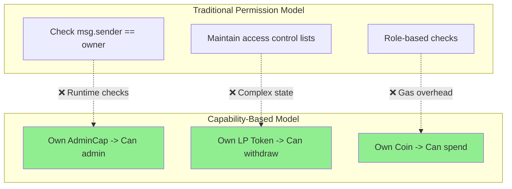

### 3. 原子操作的对象生命周期

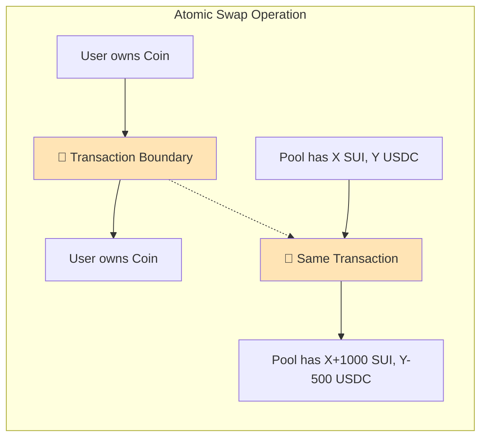

## 安全考虑

### 1. 对象所有权安全性

```rust
// ✅ 安全：系统保证只有owner能调用
public fun spend_coin(coin: Coin<SUI>) {
    // 如果能传入这个参数，就证明调用者拥有它
}

// ❌ 不安全：需要运行时检查  
// public fun spend_coin(coin_id: ID, user: address) {
//     assert!(get_owner(coin_id) == user, ENOT_OWNER);
// }
```

### 2. 共享对象的竞态条件

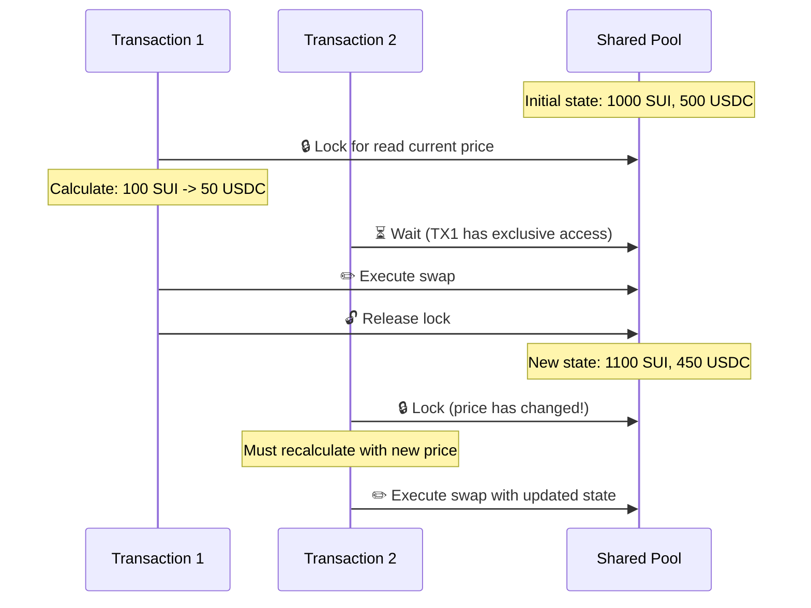

## 总结

Cetus AMM 的对象所有权架构体现了 Sui Move 的核心设计哲学：

1. **所有权即安全**：通过对象所有权而非地址检查控制权限
2. **最小化共享**：减少共享对象以提高并发性能
3. **原子操作**：复杂的状态变化在单个交易中原子完成
4. **类型安全**：编译时保证对象类型和所有权的正确性

这种设计在安全性和性能之间取得了良好的平衡，特别适合高频交易的 DeFi 应用场景。

---

**文档版本**: v1.0  
**最后更新**: 2025年8月25日  
**合约版本**: Package `0xe2f4a0385a2b5e31f67095fb4ba99e3048eb05012ba3698ef6c80fbb675fe138`