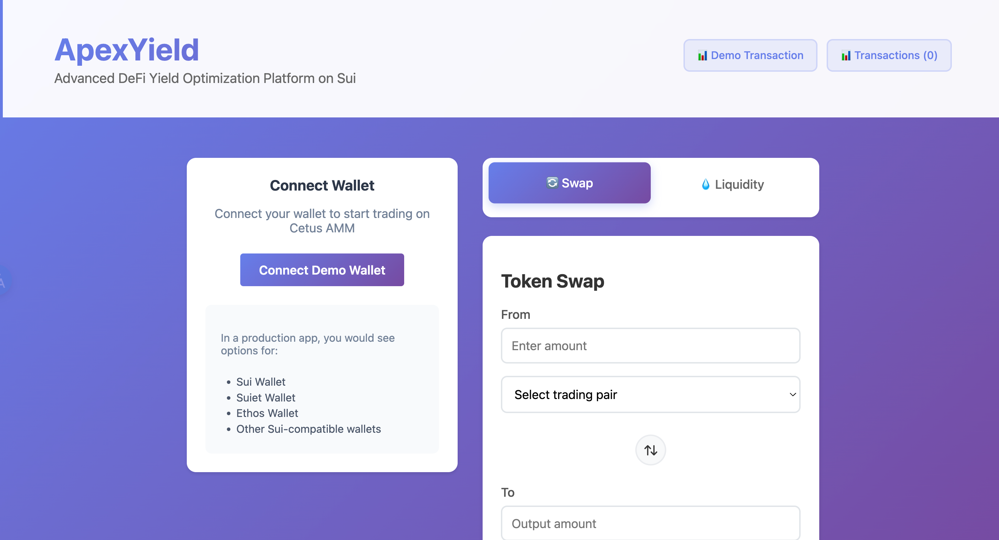

# ApexYield - Advanced DeFi Yield Optimization Platform

ApexYield is a sophisticated decentralized automated market maker (AMM) protocol built on the Sui blockchain. Our platform empowers users to trade, provide liquidity, and optimize their DeFi yields through advanced algorithmic strategies and multi-chain integrations.

## 🚀 **What is ApexYield?**

ApexYield is more than just an AMM - it's a comprehensive DeFi ecosystem designed for:

- **Seamless Token Swapping**: Trade any supported tokens with minimal slippage and optimal pricing
- **Liquidity Provision**: Earn fees by providing liquidity to trading pools with dynamic yield optimization
- **Multi-hop Routing**: Automatically find the best trading routes across multiple pools for maximum value
- **Advanced Yield Strategies**: Sophisticated algorithms that maximize returns for liquidity providers
- **Cross-chain Integration**: Built to support multiple blockchain ecosystems (starting with Sui)

## 🏗️ **Architecture Overview**

### **Multi-Chain Smart Contracts**
- **Sui Blockchain**: Primary deployment with Move-based smart contracts
- **Aptos Integration**: Extended support for Aptos ecosystem
- **Modular Design**: Built for easy extension to additional blockchains

### **Frontend Application** 
- **Framework**: Modern TypeScript + Svelte application
- **Responsive**: Optimized for desktop and mobile experiences  
- **Real-time**: Live transaction monitoring and price updates
- **User-friendly**: Intuitive interface for both beginners and DeFi experts

## 🔧 **Key Features**

### **For Traders**
- ⚡ **Instant Swaps**: Low-latency token exchanges with competitive rates
- 🛡️ **Slippage Protection**: Configurable slippage tolerance with price impact warnings
- 🔄 **Multi-hop Trading**: Automatic route optimization across multiple pools
- 📊 **Real-time Analytics**: Live market data and trading insights

### **For Liquidity Providers**
- 💰 **Earn Fees**: Collect trading fees from every swap in your pools
- 📈 **Yield Optimization**: Advanced strategies to maximize your returns
- ⚖️ **Balanced Exposure**: Automated rebalancing to maintain optimal positions
- 🔒 **Secure**: Non-custodial protocol with battle-tested smart contracts

### **For Developers**
- 🔌 **Open Source**: Full transparency with MIT licensed codebase  
- 🛠️ **Extensible**: Modular architecture for easy integration and customization
- 📚 **Well-documented**: Comprehensive docs for integration and contribution
- 🧪 **Testnet Ready**: Full testnet deployment for development and testing

## 📁 **Project Structure**

```
ApexYield/
├── sui/                    # Sui blockchain contracts (Move language)
│   ├── sources/           # Smart contract source code
│   └── Move.toml         # Sui project configuration
├── aptos/                 # Aptos blockchain contracts (Move language) 
│   ├── sources/          # Smart contract source code
│   └── Move.toml        # Aptos project configuration
├── frontend/             # TypeScript + Svelte web application
│   ├── src/             # Application source code
│   ├── public/          # Static assets
│   └── package.json     # Dependencies and scripts
├── deployments/         # Deployment configurations and addresses
├── ai/                  # Documentation and architectural guides
└── README.md           # This file
```

## 🚀 **Quick Start**

### **For Users**
1. **Connect Wallet**: Use any Sui-compatible wallet (Sui Wallet, Suiet, Ethos)
2. **Get Test Tokens**: Obtain testnet SUI and other tokens from faucets
3. **Start Trading**: Visit the ApexYield interface and begin swapping or providing liquidity
4. **Monitor Performance**: Track your positions and earnings in real-time

### **For Developers**

#### **Smart Contract Development**
```bash
# Sui contracts
cd sui/
sui move build
sui move test

# Aptos contracts  
cd aptos/
aptos move compile
aptos move test
```

#### **Frontend Development**
```bash
cd frontend/
npm install
npm run dev  # Starts at http://localhost:8080
```

## 🌐 **Deployed Networks**

### **Sui Testnet**
- **Package ID**: `0xe2f4a0385a2b5e31f67095fb4ba99e3048eb05012ba3698ef6c80fbb675fe138`
- **Network**: Sui Testnet
- **RPC**: `https://fullnode.testnet.sui.io:443`
- **Status**: ✅ Active

### **Aptos Testnet**
- **Status**: 🚧 Coming Soon

## 🛡️ **Security & Audits**

- **Open Source**: All code is publicly available for review
- **Testnet Tested**: Extensively tested on testnets before mainnet deployment
- **Community Reviewed**: Open to community contributions and security reviews
- **Non-custodial**: Users maintain full control of their funds at all times

## 📖 **Documentation**

- **[Frontend Integration Guide](ai/FRONTEND_INTEGRATION_CN.md)**: Complete guide for frontend developers
- **[Architecture Overview](ai/ARCHITECTURE.md)**: System design and technical architecture
- **[Deployment Guide](ai/DEPLOYMENT.md)**: Instructions for deploying contracts and frontend
- **[API Reference](frontend/README.md)**: Complete API documentation

## 🤝 **Contributing**

We welcome contributions from the community! Ways to contribute:

1. **🐛 Report Bugs**: Submit issues for any bugs you encounter
2. **✨ Feature Requests**: Suggest new features or improvements  
3. **🔧 Code Contributions**: Submit pull requests with fixes or enhancements
4. **📚 Documentation**: Help improve our guides and documentation
5. **🧪 Testing**: Help test new features and report findings

### **Development Setup**
1. Fork the repository
2. Create a feature branch: `git checkout -b feature/amazing-feature`
3. Make your changes and add tests
4. Submit a pull request with a clear description

## 💬 **Community & Support**

- **GitHub Issues**: [Report bugs and request features](https://github.com/apexyielders/apexyield/issues)
- **Discord**: [Join our community](https://discord.gg/apexyield)
- **Twitter**: [Follow for updates](https://twitter.com/apexyield)
- **Documentation**: [Complete guides and references](https://docs.apexyield.com)

## 📄 **License**

This project is licensed under the MIT License - see the [LICENSE](LICENSE) file for details.

## 🙏 **Acknowledgments**

- **Sui Foundation**: For the innovative blockchain infrastructure
- **Aptos Labs**: For Move language and blockchain technology  
- **DeFi Community**: For inspiration and continuous innovation
- **Contributors**: All developers who have contributed to this project

---

**ApexYield** - Maximizing your DeFi potential through intelligent yield optimization 🚀

*Built with ❤️ on Sui blockchain*
