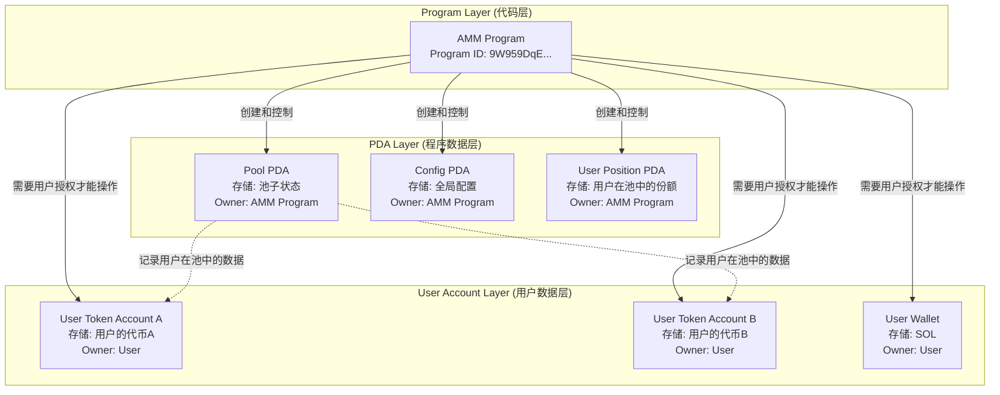
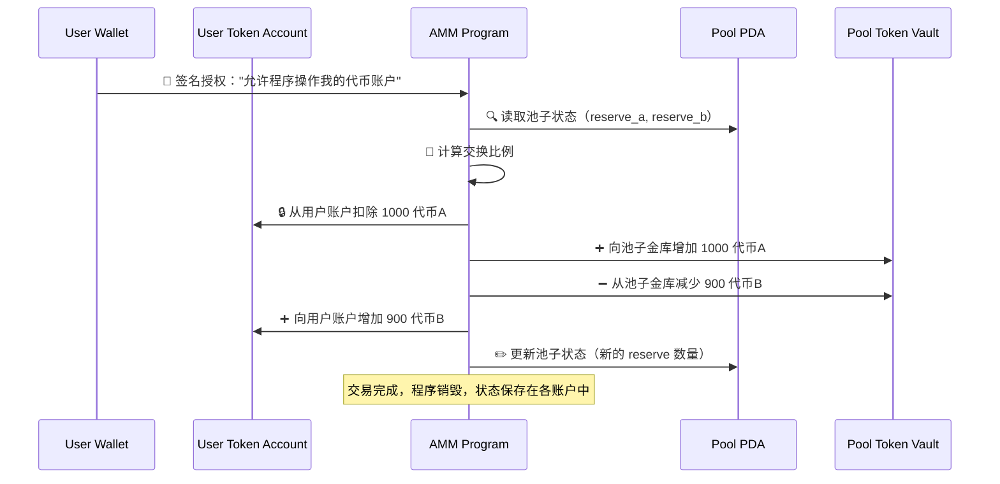

# Solana 三层架构详解

## 概述

本文档详细解释 Solana 中 Program（程序）、PDA（程序派生账户）和 User Account（用户账户）之间的控制关系，以及与 Sui Move 对象模型的对比。

## Solana 三层架构详解

### 层级关系图



## 具体例子：Solana AMM 交换

### 1. Program (代码层) - 无状态的函数

```rust
// AMM 程序代码 - 纯函数，无状态
#[program]
pub mod amm_program {
    pub fn swap(
        ctx: Context<Swap>,
        amount_in: u64,
        minimum_amount_out: u64,
    ) -> Result<()> {
        // 程序本身不存储任何数据！
        // 所有数据都在传入的账户中
        
        // 1. 从PDA读取池状态
        let pool = &mut ctx.accounts.pool_pda;
        
        // 2. 从用户账户读取代币
        let user_token_a = &mut ctx.accounts.user_token_a;
        let user_token_b = &mut ctx.accounts.user_token_b;
        
        // 3. 执行交换逻辑（修改各账户状态）
        // 4. 程序执行完毕后，状态保存在各个账户中
        
        Ok(())
    }
}
```

**Program 特征**：
- ✅ 纯函数，无状态
- ✅ 可以被任何人调用
- ✅ 执行完毕后代码"消失"，状态保存在账户中
- ❌ 不拥有任何数据

### 2. PDA (程序数据层) - 程序拥有的状态

```rust
// 池子的PDA账户 - 程序拥有和控制
#[account]
pub struct PoolState {
    pub token_a_mint: Pubkey,      // 代币A的类型
    pub token_b_mint: Pubkey,      // 代币B的类型
    pub token_a_reserve: u64,      // 池中代币A的数量
    pub token_b_reserve: u64,      // 池中代币B的数量
    pub fee_rate: u16,             // 手续费率
    pub admin_authority: Pubkey,   // 管理员
}

// PDA地址推导（可预测）
let (pool_pda, _) = Pubkey::find_program_address(
    &[b"pool", token_a_mint.as_ref(), token_b_mint.as_ref()],
    &program_id
);
```

**PDA 特征**：
- ✅ 程序完全控制这个账户的数据
- ✅ 用户无法直接修改PDA数据
- ✅ 只有程序逻辑能改变PDA状态
- ✅ 地址可预测计算

### 3. User Account (用户数据层) - 用户拥有的资产

```rust
// 用户的代币账户 - 用户拥有
pub struct UserTokenAccount {
    pub mint: Pubkey,        // 代币类型（如USDC）
    pub owner: Pubkey,       // 用户地址
    pub amount: u64,         // 用户拥有的代币数量
    pub delegate: Option<Pubkey>, // 可选的代理权限
}
```

**User Account 特征**：
- ✅ 用户完全拥有这个账户
- ❌ 程序需要用户授权才能操作
- ❌ 程序不能强制修改用户账户
- ✅ 用户可以随时撤销授权

## 三层交互的实际流程

### 用户发起交换交易

```rust
// 1. 构建交易，明确指定所有相关账户
let swap_instruction = Instruction {
    program_id: AMM_PROGRAM_ID,           // 🔧 调用哪个程序
    accounts: vec![
        // PDA账户 - 程序控制的数据
        AccountMeta::new(pool_pda, false),           // 池子状态
        AccountMeta::new(pool_token_a_vault, false), // 池子的代币A金库
        AccountMeta::new(pool_token_b_vault, false), // 池子的代币B金库
        
        // 用户账户 - 用户控制的数据  
        AccountMeta::new(user_token_a_account, false), // 用户的代币A
        AccountMeta::new(user_token_b_account, false), // 用户的代币B
        AccountMeta::new_readonly(user_authority, true), // 用户签名权限
        
        // 系统账户
        AccountMeta::new_readonly(token_program::id(), false), // SPL Token 程序
    ],
    data: SwapInstruction::Swap { 
        amount_in: 1000, 
        minimum_amount_out: 900 
    }.pack(),
};
```

### 程序执行时的数据流



## 控制关系的具体含义

### Program ← 控制 → PDA

程序对PDA拥有**完全控制权**：

```rust
// 程序对PDA的完全控制权
impl PoolState {
    // ✅ 只有程序能调用这些函数
    pub fn update_reserves(&mut self, new_a: u64, new_b: u64) {
        self.token_a_reserve = new_a;
        self.token_b_reserve = new_b;
    }
    
    pub fn set_fee_rate(&mut self, new_rate: u16) {
        self.fee_rate = new_rate;
    }
}

// 用户无法直接修改PDA数据
// ❌ 用户不能绕过程序直接改变池子状态
// ❌ 用户不能伪造池子数据
```

**控制关系特点**：
- 🔒 **排他控制**：只有拥有程序的实体才能修改PDA数据
- 🛡️ **数据完整性**：用户无法绕过程序逻辑直接篡改数据  
- 📍 **可预测地址**：PDA地址可通过种子确定性计算
- 💾 **持久状态**：程序执行结束后，状态保存在PDA中

### Program ← 需授权 → User Account

程序对用户账户只有**授权范围内的操作权**：

```rust
// 程序对用户账户的有限权限
pub fn swap(ctx: Context<Swap>) -> Result<()> {
    // ✅ 用户通过签名授权程序操作他们的代币
    let user_authority = &ctx.accounts.user_authority;
    require!(user_authority.is_signer, ErrorCode::MissingSignature);
    
    // ✅ 程序可以在授权范围内操作用户账户
    token::transfer(
        CpiContext::new(
            ctx.accounts.token_program.to_account_info(),
            Transfer {
                from: ctx.accounts.user_token_a.to_account_info(),
                to: ctx.accounts.pool_vault_a.to_account_info(),
                authority: user_authority.to_account_info(),
            },
        ),
        amount,
    )?;
    
    // ❌ 但程序不能未经授权操作用户账户
    // ❌ 用户可以撤销授权或拒绝签名
}
```

**授权关系特点**：
- ✋ **需要明确授权**：用户必须签名同意程序操作
- 🎯 **范围限定**：只能在交易中指定的操作范围内
- 🚫 **可拒绝**：用户可以拒绝签名或撤销授权
- 🔄 **临时权限**：授权仅在单次交易中有效

## 实际权限验证流程

### 程序内的多重验证

```rust
pub fn admin_function(ctx: Context<AdminContext>) -> Result<()> {
    // 1. 验证签名者身份
    require!(
        ctx.accounts.admin.is_signer,
        ErrorCode::MissingSignature
    );
    
    // 2. 验证管理员权限PDA
    let (expected_admin_pda, _) = Pubkey::find_program_address(
        &[b"admin", ctx.accounts.admin.key().as_ref()],
        ctx.program_id
    );
    require!(
        ctx.accounts.admin_pda.key() == expected_admin_pda,
        ErrorCode::InvalidAdminPDA
    );
    
    // 3. 验证管理员PDA中存储的授权信息
    require!(
        ctx.accounts.admin_pda.admin_authority == ctx.accounts.admin.key(),
        ErrorCode::Unauthorized
    );
    
    // 4. 验证池子PDA的合法性
    let (expected_pool_pda, _) = Pubkey::find_program_address(
        &[b"pool", ctx.accounts.pool.token_a_mint.as_ref(), ctx.accounts.pool.token_b_mint.as_ref()],
        ctx.program_id
    );
    require!(
        ctx.accounts.pool_pda.key() == expected_pool_pda,
        ErrorCode::InvalidPoolPDA
    );
    
    // 5. 终于可以执行管理员逻辑
    ctx.accounts.pool.fee_rate = 100;
    
    Ok(())
}
```

## 与 Sui Move 的架构对比

| 方面 | Solana 三层模式 | Sui Move 对象模式 |
|------|----------------|------------------|
| **权限验证** | 程序内部逻辑验证 | 系统级所有权验证 |
| **数据所有权** | Program owns PDA<br/>User owns Account | 系统管理对象所有权 |
| **状态管理** | 分布在不同类型账户中 | 统一在对象内部 |
| **地址可预测性** | PDA地址可预先计算 | 对象ID运行时生成 |
| **安全模型** | 依赖程序逻辑正确性 | 编译时类型安全 |
| **开发复杂度** | 需要编写权限验证代码 | 系统自动处理权限 |

### Solana 的三层分离示例

```rust
// 权限验证：程序负责
fn validate_admin(admin: &Signer, admin_pda: &Account<AdminData>) -> Result<()> {
    require!(admin.is_signer, ErrorCode::NotSigner);
    require!(admin_pda.authority == admin.key(), ErrorCode::NotAuthorized);
    Ok(())
}

// 数据管理：分层存储
struct PoolPDA { reserves: (u64, u64) }     // 程序拥有
struct UserTokenAccount { amount: u64 }     // 用户拥有

// 状态更新：跨账户协调
fn swap() {
    update_pool_reserves();      // 修改PDA
    transfer_user_tokens();      // 修改用户账户
}
```

### Sui Move 的统一对象示例

```rust
// 权限验证：系统保证
public fun admin_function(_admin_cap: &AdminCap, pool: &mut Pool) {
    // 无需验证代码，系统保证只有AdminCap拥有者能调用
    pool.fee_rate = 100;
}

// 数据管理：统一对象
public struct Pool has key {
    id: UID,
    reserves: (u64, u64),
    admin_cap_id: ID,  // 关联的权限对象
}

// 状态更新：对象内原子操作
public fun swap(pool: &mut Pool, user_coin: Coin<SUI>): Coin<USDC> {
    // 原子性状态变更，要么全成功要么全失败
}
```

## 为什么 Solana 要这样设计？

### 设计优势

#### 1. 可预测性
```rust
// 任何人都可以计算出特定池子的地址
let pool_address = calculate_pool_pda(token_a_mint, token_b_mint);
let user_token_account = get_associated_token_address(user_pubkey, mint);

// 便于：
// - 前端集成（提前知道所有地址）
// - 索引建设（可以预先准备查询结构）
// - 跨程序集成（其他程序可以直接计算地址）
```

#### 2. 灵活性
```rust
// 程序可以定义任意的数据结构
#[account]
pub struct CustomPoolState {
    pub custom_field_1: u64,
    pub custom_field_2: [u8; 32],
    pub dynamic_data: Vec<u8>,
}

// 可以创建任意数量的PDA来存储不同类型的数据
```

#### 3. 并行执行优化
```rust
// 交易明确声明要访问的账户，便于并行分析
let accounts = vec![
    AccountMeta::new(pool_pda_1, false),     // Pool 1
    AccountMeta::new(user_account_a, false), // User A's tokens
];

let accounts_2 = vec![
    AccountMeta::new(pool_pda_2, false),     // Pool 2 (different)
    AccountMeta::new(user_account_b, false), // User B's tokens (different)
];

// 系统可以确定这两个交易可以并行执行
```

### 设计复杂性成本

#### 1. 权限验证负担
```rust
// 开发者必须编写大量权限检查代码
pub fn sensitive_function(ctx: Context<SensitiveContext>) -> Result<()> {
    // 验证签名
    require!(ctx.accounts.authority.is_signer, ErrorCode::NotSigner);
    
    // 验证PDA
    let (expected_pda, _) = Pubkey::find_program_address(seeds, program_id);
    require!(ctx.accounts.pda.key() == expected_pda, ErrorCode::InvalidPDA);
    
    // 验证权限关系
    require!(ctx.accounts.pda.authority == ctx.accounts.authority.key(), ErrorCode::NotAuthorized);
    
    // 验证账户所有者
    require!(ctx.accounts.user_account.owner == &spl_token::id(), ErrorCode::InvalidOwner);
    
    // ... 更多验证
    
    // 最后才能执行实际逻辑
    Ok(())
}
```

#### 2. 状态管理复杂性
```rust
// 需要协调多种账户类型的状态变化
pub fn complex_operation(ctx: Context<ComplexOperation>) -> Result<()> {
    // 更新PDA状态
    ctx.accounts.pool_state.reserve_a += amount_a;
    ctx.accounts.pool_state.reserve_b -= amount_b;
    
    // 更新用户账户状态
    token::transfer(user_to_pool_transfer_context, amount_a)?;
    token::transfer(pool_to_user_transfer_context, amount_b)?;
    
    // 更新其他相关PDA
    ctx.accounts.user_position.liquidity += liquidity_minted;
    
    // 确保所有状态变更的一致性
    validate_invariants(&ctx.accounts)?;
    
    Ok(())
}
```

#### 3. 错误处理和回滚
```rust
// 复杂的错误处理，因为涉及多个账户
pub fn multi_step_operation(ctx: Context<MultiStepContext>) -> Result<()> {
    // Step 1
    update_pool_state(&mut ctx.accounts.pool)?;
    
    // Step 2 - 如果这里失败，需要考虑是否回滚Step 1
    transfer_tokens(&ctx.accounts.token_context)?;
    
    // Step 3 - 如果这里失败，需要考虑前面两步的状态
    mint_lp_tokens(&ctx.accounts.mint_context)?;
    
    Ok(())
}
```

## 总结

Solana 的三层架构（Program-PDA-UserAccount）是一个精心设计的分离模式：

### 核心原则
1. **代码与数据分离**：Program是无状态函数，数据存储在账户中
2. **权限分层管理**：Program控制PDA，用户控制UserAccount
3. **明确的依赖关系**：交易必须明确声明所需的所有账户

### 优势
- 🎯 **高可预测性**：地址可提前计算，便于集成和优化
- ⚡ **并行执行友好**：明确的账户依赖便于并行分析
- 🔧 **灵活的数据模型**：程序可定义任意数据结构

### 挑战
- 🛡️ **权限验证复杂**：需要大量样板代码进行安全检查
- 🧩 **状态管理分散**：需要协调多个账户的状态变更
- 🐛 **运行时错误多**：很多问题只在执行时才发现

### 与 Sui Move 的根本差异
- **Solana**：追求性能和可预测性，愿意承担复杂性成本
- **Sui Move**：追求安全和简洁，通过类型系统转移复杂性到编译期

两种设计都是对区块链架构问题的合理解答，选择取决于具体的应用需求和开发优先级。